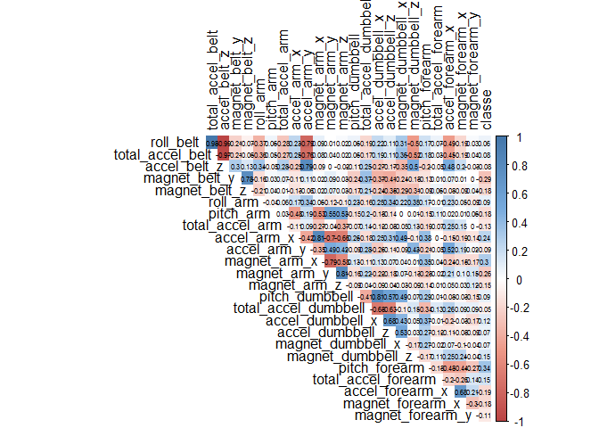
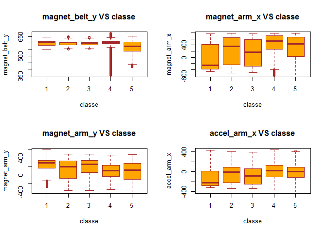
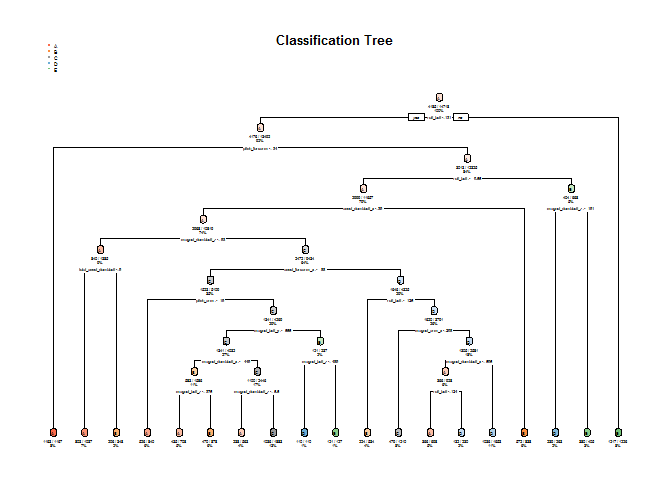

Librararies
-----------

#### Processing

    library(dplyr);library(data.table);library(plyr);library(corrplot);

#### Visualization

    library(ggplot2);library(cowplot);library(tidyr);library(Hmisc);
    library(hrbrthemes);library(viridis)

#### Machine Learning

    library(caret);library(rpart);library(rpart.plot);library(randomForest)

### Data Analysis

To Begin, we have to load data

    urlTraining <- 'https://d396qusza40orc.cloudfront.net/predmachlearn/pml-training.csv'
    urlTest <- 'https://d396qusza40orc.cloudfront.net/predmachlearn/pml-testing.csv'

    training <- read.csv(urlTraining)
    test <- read.csv(urlTest)

We going to see which are values in columns

    str(training)

    ## 'data.frame':    19622 obs. of  160 variables:
    ##  $ X                       : int  1 2 3 4 5 6 7 8 9 10 ...
    ##  $ user_name               : chr  "carlitos" "carlitos" "carlitos" "carlitos" ...
    ##  $ raw_timestamp_part_1    : int  1323084231 1323084231 1323084231 1323084232 1323084232 1323084232 1323084232 1323084232 1323084232 1323084232 ...
    ##  $ raw_timestamp_part_2    : int  788290 808298 820366 120339 196328 304277 368296 440390 484323 484434 ...
    ##  $ cvtd_timestamp          : chr  "05/12/2011 11:23" "05/12/2011 11:23" "05/12/2011 11:23" "05/12/2011 11:23" ...
    ##  $ new_window              : chr  "no" "no" "no" "no" ...
    ##  $ num_window              : int  11 11 11 12 12 12 12 12 12 12 ...
    ##  $ roll_belt               : num  1.41 1.41 1.42 1.48 1.48 1.45 1.42 1.42 1.43 1.45 ...
    ##  $ pitch_belt              : num  8.07 8.07 8.07 8.05 8.07 8.06 8.09 8.13 8.16 8.17 ...
    ##  $ yaw_belt                : num  -94.4 -94.4 -94.4 -94.4 -94.4 -94.4 -94.4 -94.4 -94.4 -94.4 ...
    ##  $ total_accel_belt        : int  3 3 3 3 3 3 3 3 3 3 ...
    ##  $ kurtosis_roll_belt      : chr  "" "" "" "" ...
    ##  $ kurtosis_picth_belt     : chr  "" "" "" "" ...
    ##  $ kurtosis_yaw_belt       : chr  "" "" "" "" ...
    ##  $ skewness_roll_belt      : chr  "" "" "" "" ...
    ##  $ skewness_roll_belt.1    : chr  "" "" "" "" ...
    ##  $ skewness_yaw_belt       : chr  "" "" "" "" ...
    ##  $ max_roll_belt           : num  NA NA NA NA NA NA NA NA NA NA ...
    ##  $ max_picth_belt          : int  NA NA NA NA NA NA NA NA NA NA ...
    ##  $ max_yaw_belt            : chr  "" "" "" "" ...
    ##  $ min_roll_belt           : num  NA NA NA NA NA NA NA NA NA NA ...
    ##  $ min_pitch_belt          : int  NA NA NA NA NA NA NA NA NA NA ...
    ##  $ min_yaw_belt            : chr  "" "" "" "" ...
    ##  $ amplitude_roll_belt     : num  NA NA NA NA NA NA NA NA NA NA ...
    ##  $ amplitude_pitch_belt    : int  NA NA NA NA NA NA NA NA NA NA ...
    ##  $ amplitude_yaw_belt      : chr  "" "" "" "" ...
    ##  $ var_total_accel_belt    : num  NA NA NA NA NA NA NA NA NA NA ...
    ##  $ avg_roll_belt           : num  NA NA NA NA NA NA NA NA NA NA ...
    ##  $ stddev_roll_belt        : num  NA NA NA NA NA NA NA NA NA NA ...
    ##  $ var_roll_belt           : num  NA NA NA NA NA NA NA NA NA NA ...
    ##  $ avg_pitch_belt          : num  NA NA NA NA NA NA NA NA NA NA ...
    ##  $ stddev_pitch_belt       : num  NA NA NA NA NA NA NA NA NA NA ...
    ##  $ var_pitch_belt          : num  NA NA NA NA NA NA NA NA NA NA ...
    ##  $ avg_yaw_belt            : num  NA NA NA NA NA NA NA NA NA NA ...
    ##  $ stddev_yaw_belt         : num  NA NA NA NA NA NA NA NA NA NA ...
    ##  $ var_yaw_belt            : num  NA NA NA NA NA NA NA NA NA NA ...
    ##  $ gyros_belt_x            : num  0 0.02 0 0.02 0.02 0.02 0.02 0.02 0.02 0.03 ...
    ##  $ gyros_belt_y            : num  0 0 0 0 0.02 0 0 0 0 0 ...
    ##  $ gyros_belt_z            : num  -0.02 -0.02 -0.02 -0.03 -0.02 -0.02 -0.02 -0.02 -0.02 0 ...
    ##  $ accel_belt_x            : int  -21 -22 -20 -22 -21 -21 -22 -22 -20 -21 ...
    ##  $ accel_belt_y            : int  4 4 5 3 2 4 3 4 2 4 ...
    ##  $ accel_belt_z            : int  22 22 23 21 24 21 21 21 24 22 ...
    ##  $ magnet_belt_x           : int  -3 -7 -2 -6 -6 0 -4 -2 1 -3 ...
    ##  $ magnet_belt_y           : int  599 608 600 604 600 603 599 603 602 609 ...
    ##  $ magnet_belt_z           : int  -313 -311 -305 -310 -302 -312 -311 -313 -312 -308 ...
    ##  $ roll_arm                : num  -128 -128 -128 -128 -128 -128 -128 -128 -128 -128 ...
    ##  $ pitch_arm               : num  22.5 22.5 22.5 22.1 22.1 22 21.9 21.8 21.7 21.6 ...
    ##  $ yaw_arm                 : num  -161 -161 -161 -161 -161 -161 -161 -161 -161 -161 ...
    ##  $ total_accel_arm         : int  34 34 34 34 34 34 34 34 34 34 ...
    ##  $ var_accel_arm           : num  NA NA NA NA NA NA NA NA NA NA ...
    ##  $ avg_roll_arm            : num  NA NA NA NA NA NA NA NA NA NA ...
    ##  $ stddev_roll_arm         : num  NA NA NA NA NA NA NA NA NA NA ...
    ##  $ var_roll_arm            : num  NA NA NA NA NA NA NA NA NA NA ...
    ##  $ avg_pitch_arm           : num  NA NA NA NA NA NA NA NA NA NA ...
    ##  $ stddev_pitch_arm        : num  NA NA NA NA NA NA NA NA NA NA ...
    ##  $ var_pitch_arm           : num  NA NA NA NA NA NA NA NA NA NA ...
    ##  $ avg_yaw_arm             : num  NA NA NA NA NA NA NA NA NA NA ...
    ##  $ stddev_yaw_arm          : num  NA NA NA NA NA NA NA NA NA NA ...
    ##  $ var_yaw_arm             : num  NA NA NA NA NA NA NA NA NA NA ...
    ##  $ gyros_arm_x             : num  0 0.02 0.02 0.02 0 0.02 0 0.02 0.02 0.02 ...
    ##  $ gyros_arm_y             : num  0 -0.02 -0.02 -0.03 -0.03 -0.03 -0.03 -0.02 -0.03 -0.03 ...
    ##  $ gyros_arm_z             : num  -0.02 -0.02 -0.02 0.02 0 0 0 0 -0.02 -0.02 ...
    ##  $ accel_arm_x             : int  -288 -290 -289 -289 -289 -289 -289 -289 -288 -288 ...
    ##  $ accel_arm_y             : int  109 110 110 111 111 111 111 111 109 110 ...
    ##  $ accel_arm_z             : int  -123 -125 -126 -123 -123 -122 -125 -124 -122 -124 ...
    ##  $ magnet_arm_x            : int  -368 -369 -368 -372 -374 -369 -373 -372 -369 -376 ...
    ##  $ magnet_arm_y            : int  337 337 344 344 337 342 336 338 341 334 ...
    ##  $ magnet_arm_z            : int  516 513 513 512 506 513 509 510 518 516 ...
    ##  $ kurtosis_roll_arm       : chr  "" "" "" "" ...
    ##  $ kurtosis_picth_arm      : chr  "" "" "" "" ...
    ##  $ kurtosis_yaw_arm        : chr  "" "" "" "" ...
    ##  $ skewness_roll_arm       : chr  "" "" "" "" ...
    ##  $ skewness_pitch_arm      : chr  "" "" "" "" ...
    ##  $ skewness_yaw_arm        : chr  "" "" "" "" ...
    ##  $ max_roll_arm            : num  NA NA NA NA NA NA NA NA NA NA ...
    ##  $ max_picth_arm           : num  NA NA NA NA NA NA NA NA NA NA ...
    ##  $ max_yaw_arm             : int  NA NA NA NA NA NA NA NA NA NA ...
    ##  $ min_roll_arm            : num  NA NA NA NA NA NA NA NA NA NA ...
    ##  $ min_pitch_arm           : num  NA NA NA NA NA NA NA NA NA NA ...
    ##  $ min_yaw_arm             : int  NA NA NA NA NA NA NA NA NA NA ...
    ##  $ amplitude_roll_arm      : num  NA NA NA NA NA NA NA NA NA NA ...
    ##  $ amplitude_pitch_arm     : num  NA NA NA NA NA NA NA NA NA NA ...
    ##  $ amplitude_yaw_arm       : int  NA NA NA NA NA NA NA NA NA NA ...
    ##  $ roll_dumbbell           : num  13.1 13.1 12.9 13.4 13.4 ...
    ##  $ pitch_dumbbell          : num  -70.5 -70.6 -70.3 -70.4 -70.4 ...
    ##  $ yaw_dumbbell            : num  -84.9 -84.7 -85.1 -84.9 -84.9 ...
    ##  $ kurtosis_roll_dumbbell  : chr  "" "" "" "" ...
    ##  $ kurtosis_picth_dumbbell : chr  "" "" "" "" ...
    ##  $ kurtosis_yaw_dumbbell   : chr  "" "" "" "" ...
    ##  $ skewness_roll_dumbbell  : chr  "" "" "" "" ...
    ##  $ skewness_pitch_dumbbell : chr  "" "" "" "" ...
    ##  $ skewness_yaw_dumbbell   : chr  "" "" "" "" ...
    ##  $ max_roll_dumbbell       : num  NA NA NA NA NA NA NA NA NA NA ...
    ##  $ max_picth_dumbbell      : num  NA NA NA NA NA NA NA NA NA NA ...
    ##  $ max_yaw_dumbbell        : chr  "" "" "" "" ...
    ##  $ min_roll_dumbbell       : num  NA NA NA NA NA NA NA NA NA NA ...
    ##  $ min_pitch_dumbbell      : num  NA NA NA NA NA NA NA NA NA NA ...
    ##  $ min_yaw_dumbbell        : chr  "" "" "" "" ...
    ##  $ amplitude_roll_dumbbell : num  NA NA NA NA NA NA NA NA NA NA ...
    ##   [list output truncated]

We have seen that there is several columns whit empty values, then going
to replace to NA

    training[training==""] <- NA
    test[test==""] <- NA

This column with NA are very long, so going to DROP

    #Drop column with NA
    na_count <-sapply(training, function(x) sum(length(which(is.na(x)))))
    na_count <- data.frame(na_count)

    removeCol <- na_count %>% {which(.>0)}
    removeCol <- c(rownames(na_count)[removeCol])
    training <- training[,-which(names(training) %in% removeCol)]
    test <- test[,-which(names(test) %in% removeCol)]

    #Drop column without values
    removeCol2 <- c("X","user_name","cvtd_timestamp")
    training <- training[,-which(names(training) %in% removeCol2)]
    test <- test[,-which(names(test) %in% removeCol2)]

new\_window is a column binary(yes and not), so going to transform this
column in num with values 1 and 0

    #Convert Character to number to new_window
    unique(training$new_window)

    ## [1] "no"  "yes"

    training$new_window <- revalue(training$new_window,c("yes" = 1))
    training$new_window <- revalue(training$new_window, c("no"=0))
    test$new_window <- revalue(test$new_window, c("no"=0))
    training$new_window<- as.numeric(training$new_window)
    test$new_window <- as.numeric(test$new_window)

#### Compute Correlation values

Going to compute correlation values to see which are relevant column

    #COMPUTE CORRELATION
    dataC <- training
    dataC$classe <- as.numeric(as.factor(dataC$classe))

    mat <- data.frame(formatC(cor(dataC , method ="pearson"), format="f", digits=1))
    mat[] <- lapply(mat, as.numeric)

Here going to remove column without relation with column classe

    #Drop column without Correlation
    lowCor <- mat%>% {which(mat$classe == 0.0)}
    removelowCor <- c(rownames(mat)[lowCor])

    dataC <- dataC[,-which(names(dataC) %in% removelowCor)]

### Visualization of Correlations

    corr2 <- function(data,
                      method = "pearson",
                      sig.level = 0.05,
                      order = "original",
                      diag = FALSE,
                      type = "upper",
                      tl.srt = 90,
                      number.font = 0.5,
                      number.cex = 0.5,
                      mar = c(0, 0, 0, 0)) {
      

      data_incomplete <- data
      data <- data[complete.cases(data),]
      mat <- cor(data, method = method)
      cor.mtest <- function(mat, method) {
        mat <- as.matrix(mat)
        n <- ncol(mat)
        p.mat <- matrix(NA, n, n)
        diag(p.mat) <- 0
        for ( i in 1:(n - 1)) {
          for (j in (i + 1):n) {
            tmp <- cor.test(mat[,i], mat[, j], method = method)
            p.mat[i, j] <- p.mat[j,i] <- tmp$p.value
            
          }
        }
        
        colnames(p.mat) <- rownames(p.mat) <- colnames(mat)
        p.mat
      }
      p.mat <- cor.mtest(data, method = method)
      col <- colorRampPalette(c("#BB4444", "#EE9988", "#FFFFFF", "#77AADD", "#4477AA"))
      corrplot(mat, 
               method = "color", col= col(200), number.font = number.font,
               mar = mar, number.cex = number.cex,
               type = type, order = order,
               addCoef.col = "black",
               # add correlation coefficient
               tl.col = "black", tl.srt = tl.srt, # Rotation of text labels,
               # combine with significance level
               p.mat = p.mat, sig.level = sig.level, insig = "blank",
               # hide correlation coefficiens on the diagonal
               diag = diag
      )
    }

    #COMPUTE CORRELATION
    corr2(
      data = dataC,
      method= "pearson",
      sig.level = 0.05,
      order = "original",
      diag = FALSE,
      type = "upper",
      tl.srt = 90
      
    )

relation of the values diplayes through boxplot boxes

    par(mfrow=c(2,2))
    boxplot(magnet_belt_y~classe,
            data=dataC,
            main="magnet_belt_y VS classe",
            xlab="classe",
            ylab="magnet_belt_y",
            col="orange",
            border="brown"
    )
    boxplot(magnet_arm_x~classe,
            data=dataC,
            main="magnet_arm_x VS classe",
            xlab="classe",
            ylab="magnet_arm_x",
            col="orange",
            border="brown"
    )

    boxplot(magnet_arm_y~classe,
            data=dataC,
            main="magnet_arm_y VS classe",
            xlab="classe",
            ylab="magnet_arm_y",
            col="orange",
            border="brown"
    )

    boxplot(accel_arm_x~classe,
            data=dataC,
            main="accel_arm_x VS classe",
            xlab="classe",
            ylab="accel_arm_x",
            col="orange",
            border="brown"
    )

Clean principal dataset

    #Remove Col from principal dataset
    training <- training[,-which(names(training) %in% removelowCor)]
    test <- test[,-which(names(test) %in% removelowCor)]

### Models

#### rpart

    inTrain <- createDataPartition(y=training$classe, p=0.75, list=FALSE)
    trainM <- training[inTrain, ] 
    testM <- training[-inTrain, ]

    # Fit model
    modFitDT <- rpart(classe ~ ., data=trainM, method="class")
    # Perform prediction
    predictDT <- predict(modFitDT, testM, type = "class")

    # Plot result
    par(mfrow=c(1,1))
    rpart.plot(modFitDT, main="Classification Tree", extra=102, under=TRUE, faclen=0)

    testM$classe <- as.factor(testM$classe)
    confusionMatrix(predictDT, testM$classe)

    ## Confusion Matrix and Statistics
    ## 
    ##           Reference
    ## Prediction    A    B    C    D    E
    ##          A 1174  196   97   89   86
    ##          B   57  486  178   64  146
    ##          C  109  169  507  147   69
    ##          D   44   94   73  501   46
    ##          E   11    4    0    3  554
    ## 
    ## Overall Statistics
    ##                                           
    ##                Accuracy : 0.657           
    ##                  95% CI : (0.6435, 0.6703)
    ##     No Information Rate : 0.2845          
    ##     P-Value [Acc > NIR] : < 2.2e-16       
    ##                                           
    ##                   Kappa : 0.5634          
    ##                                           
    ##  Mcnemar's Test P-Value : < 2.2e-16       
    ## 
    ## Statistics by Class:
    ## 
    ##                      Class: A Class: B Class: C Class: D Class: E
    ## Sensitivity            0.8416   0.5121   0.5930   0.6231   0.6149
    ## Specificity            0.8666   0.8875   0.8780   0.9373   0.9955
    ## Pos Pred Value         0.7150   0.5220   0.5065   0.6609   0.9685
    ## Neg Pred Value         0.9323   0.8835   0.9108   0.9269   0.9199
    ## Prevalence             0.2845   0.1935   0.1743   0.1639   0.1837
    ## Detection Rate         0.2394   0.0991   0.1034   0.1022   0.1130
    ## Detection Prevalence   0.3348   0.1898   0.2041   0.1546   0.1166
    ## Balanced Accuracy      0.8541   0.6998   0.7355   0.7802   0.8052

#### random forest

    RF_modfit <- train(classe ~ ., data = trainM, method = "rf", ntree = 100)
    RF_prediction <- predict(RF_modfit, testM)

    RF_pred_conf <- confusionMatrix(RF_prediction, testM$classe)
    RF_pred_conf

    ## Confusion Matrix and Statistics
    ## 
    ##           Reference
    ## Prediction    A    B    C    D    E
    ##          A 1388    8    0    2    0
    ##          B    4  929    6    1    4
    ##          C    0    9  846   14    4
    ##          D    2    1    3  787    7
    ##          E    1    2    0    0  886
    ## 
    ## Overall Statistics
    ##                                           
    ##                Accuracy : 0.9861          
    ##                  95% CI : (0.9825, 0.9892)
    ##     No Information Rate : 0.2845          
    ##     P-Value [Acc > NIR] : < 2.2e-16       
    ##                                           
    ##                   Kappa : 0.9825          
    ##                                           
    ##  Mcnemar's Test P-Value : NA              
    ## 
    ## Statistics by Class:
    ## 
    ##                      Class: A Class: B Class: C Class: D Class: E
    ## Sensitivity            0.9950   0.9789   0.9895   0.9789   0.9834
    ## Specificity            0.9972   0.9962   0.9933   0.9968   0.9993
    ## Pos Pred Value         0.9928   0.9841   0.9691   0.9837   0.9966
    ## Neg Pred Value         0.9980   0.9949   0.9978   0.9959   0.9963
    ## Prevalence             0.2845   0.1935   0.1743   0.1639   0.1837
    ## Detection Rate         0.2830   0.1894   0.1725   0.1605   0.1807
    ## Detection Prevalence   0.2851   0.1925   0.1780   0.1631   0.1813
    ## Balanced Accuracy      0.9961   0.9876   0.9914   0.9878   0.9913

### Result

The confusion matrices show, that the Random Forest algorithm performens
better than decision trees. The accuracy for the Random Forest model was
0.9865 (95% CI:(0.9829, 0.9896)) compared to 0.6654 (95% CI: (0.652,
0.6786)) for rpart. The random Forest model is choosen.

    #FINAL TEST
    Final_RF_prediction <- predict(RF_modfit, test )
    Final_RF_prediction

    ##  [1] B A B A A E D B A A B C B A E E A B B B
    ## Levels: A B C D E
